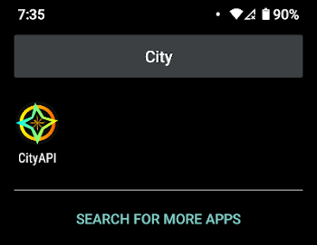
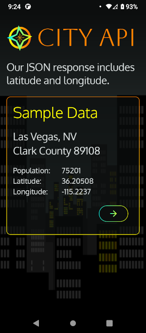

# Jetpack Compose Adaptive Layout, Animations, Onboarding

This Jetpack Compose app features an adaptive layout for phones, tablets,
foldables, and desktop. It serves as a front-end for a Ktor API that
gets city data and allows users to manage their API keys.

## Part 1

Links:
* Free SVGs: https://freesvg.org
* Inkscape: https://inkscape.org/
* SVG Minifier: https://www.svgminify.com/

In part 1, I'll go over my onboarding screens, which include:

* Custom SVG icons
* Glass morphism
* Material 3 Dark Theme
* Adaptive layouts
* Jetpack Compose Animations

## Design

Inspiration: City lights, Neon

### App SVG Icon

### Onboarding - Welcome

## Part 2

* Sign in with Google
* Get city data from a Ktor API
* Users can manage API keys